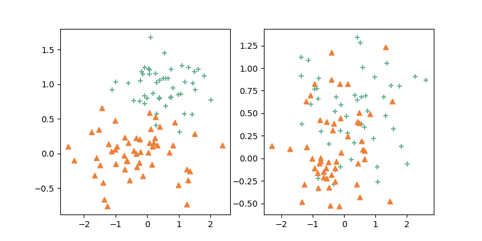
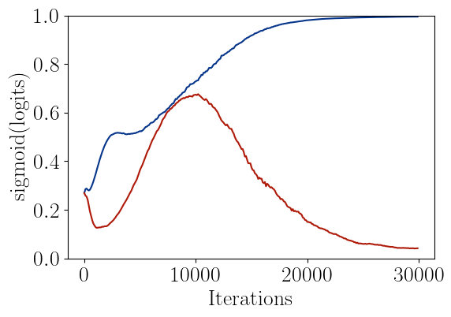

# Focused Adversarial Invariance Regularized Estimation


This repository contains code to reproduce the simulation and real dataset application in our manuscript [Causality Pursuit from Heterogeneous Environments via Neural Adversarial Invariance Learning](https://arxiv.org/pdf/2405.04715). We also provide a unified implementation and interface to run the algorithm using user-specified function class and loss.


To cite this paper:
```bibtex
@article{gu2024causality,
  title={Causality Pursuit from Heterogeneous Environments via Neural Adversarial Invariance Learning},
  author={Gu, Yihong and Fang, Cong and B{\"u}hlmann, Peter and Fan, Jianqing},
  journal={arXiv preprint arXiv:2405.04715},
  year={2024}
}
```

## Instructions to reproduce the results

### Simulations

#### Try one trial

To run a FAIR-Linear estimation under the data generating process described in Sec 5.2.1: the unit test task with dimension `d`, sample size `n`, and random seed `s`

```bash
python test_fairll.py --mode 3 --dim_x [d] --seed [s] --n [n] 
```

To run a FAIR-NN estimation under the data generating process described in Sec 5.2.2: the unit test task with sample size `n` and random seed `s`:

```bash
# m^\star_1: additive regression function
python test_fairnn.py --mode 4 --seed [s] --n [n] 
# m^\star_2: hierarchical composition model regression function
python test_fairnn.py --mode 5 --seed [s] --n [n] 
```

#### Result summary

Here are the steps to reproduce the results in Fig. 3 & 5:

```bash
# First run the simulations
python unit_test.py --mode 1 --ntrial 50     # run simulations in Fig. 3a)
python unit_test.py --mode 2 --ntrial 50     # run simulations in Fig. 3b)
python unit_test.py --mode 3 --ntrial 50     # run simulations in Fig. 5a)
python unit_test.py --mode 4 --ntrial 50     # run simulations in Fig. 5b)
# Plot figures
python unit_test_vis.py --mode 1 --ntrial 50     # plot Fig. 3a)
python unit_test_vis.py --mode 2 --ntrial 50     # plot in Fig. 3b)
python unit_test_vis.py --mode 3 --ntrial 50     # plot in Fig. 5a)
python unit_test_vis.py --mode 4 --ntrial 50     # plot in Fig. 5b)
```

The execution time for lines 2-5 is 1 day per line in a laptop, and it will save the results in the `saved_result` directory. We also include the simulation result run by our laptop in the `saved_results` directory, one can directly plot them using lines 7-10.

### Real data application I: discovery from real physical system

We first run the bootstrap and algorithm by $T=100$ replications for various $n$

```bash
python app1_lightchamber.py --mode 3 --n 1000 --nrep 100 --niter 100000
python app1_lightchamber.py --mode 3 --n 2000 --nrep 100 --niter 100000
python app1_lightchamber.py --mode 3 --n 500 --nrep 100 --niter 100000
python app1_lightchamber.py --mode 3 --n 200 --nrep 100 --niter 100000
```

The implementation of nonlinearICP can be realized by first sample dataset and run the R code `nonlinearICP.R`, the data is generated by running

```bash
python app1_lightchamber.py --mode 4 --n 1000 --nrep 100
```

The results can then be plotted using the following commands

```bash
python app1_lightchamber.py --mode 6 --n 1000      # plot Fig. 6b)
python app1_lightchamber.py --mode 7               # plot Fig. 6c)
python app1_lightchamber.py --mode 8               # plot Fig. 6d)
python app1_lightchamber.py --mode 9 --n 200       # plot Fig. 6e)
```

### Real data application II: prediction based on extracted features

We will use the [CUB](https://www.vision.caltech.edu/datasets/cub_200_2011) and [Places](http://places2.csail.mit.edu) dataset to generate our waterbird dataset. The above two datasets can be found at [Google Drive](https://drive.google.com/drive/folders/1cCrbijIyGAOQ_uB8SdQnT43eaB7bi8Qj). The data can be generated by the command `python generate_waterbird.py`,  and the dataset will be saved in `./res`.

Then, you can run `python app2_waterbird.py --method FAIR --nstart 10` to train our FAIR linear logistic regression model on the waterbird dataset saved in `./res` for 10 times. We also support other methods, including LASSO, IRM, and GroupDRO. You can apply the methods above by changing the instructions. You can check the curve of test accuracy in `./saved_results/waterbird_test_curve.pdf`.

## Customizing your own estimator

We also provide a unified FAIR estimation implementation (using gradient descent ascent with Gumbel approximation) if the user can specify the generator/discriminator by inheriting the `FairModel` class. We use a toy sample akin to the thought experiment in the introduction to illustrate how one can customize the estimator. The sample code can be found at [toy_sample.py](toy_sample.py).

### Data Generating Process

We consider the following two-environment model

$$
\begin{cases}
	X_1^{(e)} &\gets \mathcal{N}(0,1) \\
	Y^{(e)} &\gets \mathrm{Bern}(\sigma(X_1^{(e)})) \\
	Z^{(e)} &\gets \mathrm{Bern}(s^{(e)}) \\
	X_2^{(e)} &\gets (Y^{(e)} \cdot Z^{(e)} + (1-Y^{(e)}) (1-Z^{(e)})) s^{(e)} + \mathcal{N}(0,0.3)
 \end{cases}
 $$

where $s^{(1)}=0.99$ and $s^{(2)}=0.70$ measures the degree of spuriousness in environment $e\in \{1,2\}$, $\sigma(t)=1/(1+e^{-t})$ and $\mathrm{Bern}(u)$ is a Bernoulli random variable with $\mathbb{E}[\mathrm{Bern}(u)]=u$. Our target is to build a linear classifier on top of $(X_1, X_2)$ to predict $Y$. 

The above toy synthetic data can be seen as a simplification of the cow-vs-camebl classification thought experiment. Here $X_1$ is the invariant/core/causal variable that can produce stable prediction to $Y$, $X_2$ is the spurious/reverse causal variable. We also consider the case where $(s^{(1)}-0.5) (s^{(2)}-0.5)>0$, that is, the spurious correlations are in the same direction (either all positive or all negative) such that it is impossible to reweight the two environments to make the spurious signal canceled.

We implement the above data-generating process using a `ClassificationSCM` class

```python
import numpy as np
import torch

class ClassificationSCM:
	def __init__(self, spur=0.95):
		self.spur = spur

	def sample(self, n):
		x = np.random.normal(0, 1, n)
		y = (np.random.uniform(0, 1, n) <= 1.0/(1+np.exp(-x))) * 1.0
		coin_flip = (np.random.uniform(0, 1, n) <= self.spur) * 1.0
		z = (y * coin_flip + (1 - y) * (1 - coin_flip)) * self.spur
		z = z + np.random.normal(0, 0.3, n)
		xx = np.concatenate([np.reshape(x, (n, 1)), np.reshape(z, (n, 1))], 1)
		yy = np.reshape(y, (n, 1))
		return xx, yy

```

One can further visualize the two environment data by sampling $n=100$​ data from each environment. 

```python
np.random.seed(376)
torch.manual_seed(376)
n = 100
models = [ClassificationSCM(0.99), ClassificationSCM(0.70)]
x1, y1 = models[0].sample(100)
x2, y2 = models[1].sample(100)

e1y1x = x1[np.squeeze(y1) == 1, :]
e1y0x = x1[np.squeeze(y1) == 0, :]
e2y1x = x2[np.squeeze(y2) == 1, :]
e2y0x = x2[np.squeeze(y2) == 0, :]

import matplotlib.pyplot as plt
figs, axs = plt.subplots(1, 2, figsize=(8, 4))

axs[0].scatter(e1y1x[:, 0], e1y1x[:, 1], color='#6bb392', marker='+')
axs[0].scatter(e1y0x[:, 0], e1y0x[:, 1], color='#ec813b', marker='^')
axs[1].scatter(e2y1x[:, 0], e2y1x[:, 1], color='#6bb392', marker='+')
axs[1].scatter(e2y0x[:, 0], e2y0x[:, 1], color='#ec813b', marker='^')

plt.savefig('saved_results/sample_data.png')
```

At first glance, we can only see that the best linear predictors using the two variables are not the same in the two environments, but it is hard to tell which variable is invariant.



### Inheriting the `FairModel` Class

In order to leverage the repo's implementation of the Gumbel approximation, one should inherit the abstract class `FairModel`. This class inherits the `nn.Module` class in Pytorch and shares similar logits with that. One should implement the four methods described below

- `def __init__(self, num_envs, dim_x, ...)`: in the method, it should define all the `nn.Modules` to be used, its input argument should include (1) the number of environments `num_envs` because it should create `num_envs` discriminators; and (2) the input dimension `dim_x`. User can also define their own newly introduced arguments. One should set `self.num_envs=num_envs` and `self.dim_x=dim_x` in the method.
- `def parameters_g(self, log=False)`: in the method,  one should return all the parameters of the predictor `g`. If `g` is an `nn.Module`, it suffices to return `g.parameters()`. One can print the parameters information when `log=True`. 

- `def parameters_f(self, log=False)`: in the method,  one should return all the parameters of all the discriminators `f`. One can print the parameters information when `log=True`. 
- `def forward(self, xs, pred=False)`: the forward method should be slightly modified because of the multi-environment setting. We consider the following two cases
  - `pred=True`: this case is for evaluation and is almost identical to the standard forward method, the input `xs` is a `[n,dim_x]` tensor and it should return a `[n,1]` tensor representing the output. 
  - `pred=False`: this case is for training, the input `xs` is a list of tensors with shape `[n1,dim_x]`, ..., `[nk,dim_x]` where `k` is the number of environments (`k` should be equal to `num_envs`), the output is two `[n,1]` shape tensors with `n=n1+...+nk`. The `i`-th row of the first tensor represents the output of the predictor $g$ in sample `i`, and the `i`-th row of the second tensor represents the output of the corresponding $f^{(e)}$ in sample `i`, given the sample `i` is from environment $e$. 

As an example, here we implement the classification module as follows

```python
from methods.fair_algo import *

class FairLinearClassification(FairModel):
	def __init__(self, num_envs, dim_x):
		super(FairLinearClassification, self).__init__(num_envs, dim_x)
		self.g = nn.Sequential(nn.Linear(dim_x, 1), nn.Sigmoid())
		self.fs = []
		for e in range(num_envs):
			fe = nn.Linear(dim_x, 1)
			self.fs.append(fe)

	def parameters_g(self, log=False):
		if log:
			print(f'FairLinearClassification Predictor Module Parameters:')
			for para in self.g.parameters():
				print(f'Parameter Shape = {para.shape}')
		return self.g.parameters()

	def parameters_f(self, log=False):
		paras = []
		for i in range(self.num_envs):
			if log:
				print(f'FairLinearClassification Discriminator ({i}) Module Parameters:')
				for para in self.fs[i].parameters():
					print(f'Parameter Shape = {para.shape}')				
			paras += self.fs[i].parameters()
		return paras

	def forward(self, xs, pred=False):
		if pred:
			return self.g(xs)
		else:
			out_g = self.g(torch.cat(xs, 0))
			out_fs = []
			for e in range(self.num_envs):
				out_fs.append(self.fs[e](xs[e]))
			out_f = torch.cat(out_fs, 0)
			return out_g, out_f
```


### Run the algorithm and visualize the results

We also need to specify the training loss $\ell(v, y)$ and loss for evaluation using `torch` and `numpy` as follows

```python
def bce_loss(out_prob, cat_y):
	return -0.5 * torch.mean((cat_y * torch.log(out_prob + 1e-9) + (1 - cat_y) * torch.log(1 - out_prob + 1e-9)))

def misclass(pred_y, y):
	return 1 - np.mean((pred_y >= 0.5) * y + (pred_y < 0.5) * (1 - y))
```

Given the implemented `FairModel`, we can call the algorithm implemented in the `FairGumbelAlgo` class. For evaluation, we use an RCT environment with $s=0.5$ as validation dataset and an environment with reverse spurious association $s=0.05$ as the test dataset. We first create the `model` and dataset 

```python
model = FairLinearClassification(2, 2)

xs, ys = [x1, x2], [y1, y2]
x3, y3 = ClassificationSCM(0.5).sample(3000)
x4, y4 = ClassificationSCM(0.05).sample(3000)
valid = [x3], [y3]
test = [x4], [y4]
```

Then we should set the hyper-parameters, the first two rows are standard in gradient descent training. The third row specifies that `giters` number of generator gradient descent updates follows from `diters` number of discriminator gradient ascent updates, we found that `diters=3` and `giters=1` work well for most of the cases. The last row specifies how we anneal the temperature $\tau$ during training. 

```python
hyper_params = {
	'gumbel_lr': 1e-3, 'model_lr': 1e-3, 'batch_size': 100, 'niters': 30000,
	'weight_decay_g': 0, 'weight_decay_f': 0,
	'diters': 3, 'giters': 1, 
	'init_temp': 5, 'final_temp': 0.1, 'offset': -1, 'anneal_iter': 100, 'anneal_rate': 0.993,
}
```

We then can call the algorithm as follows

```python
algo = FairGumbelAlgo(num_envs=2, dim_x=2, model=model, gamma=36, loss=bce_loss, hyper_params=hyper_params)
packs = algo.run_gumbel((xs, ys), eval_metric=misclass, me_valid_data=valid, me_test_data=test, eval_iter=3000, log=True)
```

In the first row, we specify the number of environments, feature dimension, causal hyper-parameter $\gamma$, and other training hyper-parameters. We also plug in our implemented `FairModel` `model` and loss `bce_loss` as input arguments. The second row runs the gradient descent ascent with Gumbel approximation. It shows the following logs:

```
FairLinearClassification Predictor Module Parameters:
Parameter Shape = torch.Size([1, 2])
Parameter Shape = torch.Size([1])
FairLinearClassification Discriminator (0) Module Parameters:
Parameter Shape = torch.Size([1, 2])
Parameter Shape = torch.Size([1])
FairLinearClassification Discriminator (1) Module Parameters:
Parameter Shape = torch.Size([1, 2])
Parameter Shape = torch.Size([1])
iteration (2999/30000), valid_loss = [0.3476666666666667], test_loss = [0.3633333333333333]
gate logits = [0.52, 0.18,]
gate est = [0.49, 0.37,]
iteration (5999/30000), valid_loss = [0.3986666666666666], test_loss = [0.44599999999999995]
gate logits = [0.55, 0.46,]
gate est = [0.52, 0.46,]
iteration (8999/30000), valid_loss = [0.42466666666666664], test_loss = [0.4613333333333334]
gate logits = [0.68, 0.66,]
gate est = [0.58, 0.59,]
iteration (11999/30000), valid_loss = [0.42366666666666664], test_loss = [0.45433333333333337]
gate logits = [0.81, 0.61,]
gate est = [0.67, 0.55,]
iteration (14999/30000), valid_loss = [0.41400000000000003], test_loss = [0.44899999999999995]
gate logits = [0.92, 0.39,]
gate est = [0.72, 0.46,]
iteration (17999/30000), valid_loss = [0.3833333333333333], test_loss = [0.42800000000000005]
gate logits = [0.97, 0.23,]
gate est = [0.89, 0.32,]
iteration (20999/30000), valid_loss = [0.3533333333333334], test_loss = [0.3946666666666667]
gate logits = [0.98, 0.13,]
gate est = [0.94, 0.18,]
iteration (23999/30000), valid_loss = [0.3426666666666667], test_loss = [0.3546666666666667]
gate logits = [0.99, 0.07,]
gate est = [0.97, 0.08,]
iteration (26999/30000), valid_loss = [0.33366666666666667], test_loss = [0.349]
gate logits = [0.99, 0.05,]
gate est = [0.99, 0.10,]
iteration (29999/30000), valid_loss = [0.33399999999999996], test_loss = [0.3456666666666667]
gate logits = [0.99, 0.04,]
gate est = [1.00, 0.08,]
```

One can visualize the dynamics of Gumbel logits during training using the method in `utils.py`

```python
from utils import print_gate_during_training
print_gate_during_training(2, ([0], [1], []), packs['gate_rec'], 'saved_results/sample_gate.png')
```

The result is as follows, the blue line represents that of the invariant feature and the red line represents that of the spurious feature. 



